# Human Motion Analysis with Kinect v2

### Why?

- I've noticed most studies or projects in this space only use the joint centers to compute planar projection angles, or the angles between vectors, and don't quantify 3D rotations in a similar way that researchers would if using something like Qualisys or Vicon.
- People still use the Kinect since it's cheap, and you can probably find someone who has one lying around in a drawer somewhere (I got mine in exchange for a few gyros wraps).
- These concepts and code can be adapted for the newer Kinect Azure cameras (from what I understand of those newer systems) and potentially other markerless motion capture systems.

### Main applications

- Gross-level human motion analysis (e.g., strength and conditioning movement assessments)

- Mediolateral, Anteroposterior, and Vertical Axis rotations for hip and knee joint (based on the International Society of Biomechanics (ISB) recommendations by [Wu and Cavanagh](https://www.ece.uvic.ca/~bctill/papers/mocap/Wu_Cavanagh_1995.pdf) (1995) and [Wu et al.](https://www.sciencedirect.com/science/article/pii/S0021929001002226?casa_token=2dAvjy8tpVsAAAAA:WMEtDcaXO0Jrg_GirWFR84c3w4etz7MzVceTSjGYivBhKOUqNOeWdkNDgGFfgN9g4q-3XHU43w) (2002). Also see [Research Methods in Biomechanics](https://www.amazon.ca/Research-Methods-Biomechanics-2nd-Gordon-Robertson/dp/0736093400) by Gordon Roberston et al. for more information)

  - Joint center tracking (25 total "joints", elaborated on more below)

- Teaching tool for undergraduate or graduate students (depending on how much "raw" data is made available)

- Can be scaled for undergraduate and graduate students in kinesiology, physiotherapy, chiropractic, engineering, or related disciplines

- Much easier (and cheaper) to first learn with a markerless system relative to a marker-based system!

### What this overview does not do

- Provide a rigorous overview of the math and other skills required for collecting and processing motion data (for markerless or marker-based systems).

  - Some supplementary information is available for students or researchers who may want an additional refresher of the material or a better understanding of the computations without digging into the code right away.

- Teach you how to analyze your data following its extraction appropriately.

- Capture upper extremity joint angles based on ISB recommendations.

- Operate as a diagnostic or screening tool.

## tl;dr

- `.\DumpKinectSkeleton.exe --prefix=<prefix>` is the command to collect the data with the connect. Make sure that a standing calibration (in anatomical position ) is collected along with any motion trials. This has been cloned from the [DumpKinectSkeleton repository created by sebtoun](https://github.com/sebtoun/DumpKinectSkeleton) (Sebastien Andary)

  - only runs with Windows 8 or later.

- `python kinectPipeline.py -i <inputfile> -c <calfile> -o <outputfile>` is the command to take the csv outputs from the DumpKinectSkeleton command and create a new csv file with joint angles based on ISB recommendations.

  - can be used with Windows, macOS, or Linux as long as you have Python 3.7, Pandas, NumPy, and SciPy installed.

## 1 Getting started

### 1.1 Getting the Kinect SDK running on your computer

Many existing guides can direct people on how to get the Kinect "running" on your computer. I'll provide a brief overview of the software and hardware required and then provide links to other helpful resources below. You can read more on the [Xbox Support Website](https://support.xbox.com/en-CA/help/hardware-network/kinect/kinect-for-windows-v2-setup-with-adapter) as well. Essentially, though, all it involves is downloading the software development kit (SDK) and connecting the Kinect using an adaptor.

*Hardware Requirements (Minimum)*

- USB 3.0 port
- [Kinect adaptor /Power supply unit/ USB 3.0 cable combination](https://www.amazon.ca/Kinect-Adapter-Sensor-Windows-Version/dp/B07MDB1DQY/ref=sr_1_1_sspa?dchild=1&keywords=kinect+windows+adapter&qid=1618065435&sr=8-1-spons&psc=1&smid=A3K3D4LA1E20ZI&spLa=ZW5jcnlwdGVkUXVhbGlmaWVyPUFGWEk4RjE2RlEyQ0gmZW5jcnlwdGVkSWQ9QTA4ODY2NzkzMEhOVzMwWFpUWTdJJmVuY3J5cHRlZEFkSWQ9QTA3Njg0NDYyODcxTUdDR0pUU0lPJndpZGdldE5hbWU9c3BfYXRmJmFjdGlvbj1jbGlja1JlZGlyZWN0JmRvTm90TG9nQ2xpY2s9dHJ1ZQ==) (unless you have a Kinect v2 for Windows as this is part of the package)
- 64-bit (x64) processor
- Dual-core 3.2GHz or faster processor
- 2GB RAM

*Software Requirements*

- Windows 8 or later

- [Kinect SDK 2.0](https://www.microsoft.com/en-ca/download/details.aspx?id=44561)

- Microsoft Visual Studio 2012 Express or later

- .NET Framework 4.5

- Python 3.7 (recommended to create an environment using [Miniconda](https://docs.conda.io/projects/continuumio-conda/en/latest/user-guide/install/macos.html) or [Anaconda](https://docs.anaconda.com/anaconda/install/) to run locally or copy and paste into Google Colab- only required for data processing pipeline, not the Kinect itself)

- - Pandas (1.1.5)
  - NumPy (1.19.5)
  - SciPy (1.4.1)

*Other Helpful Resources*

- ["How to Connect a Kinect"](https://www.instructables.com/How-to-Connect-a-Kinect/)
- [Set up Kinect for Windows v2 with a Kinect Adaptor for Windows 10 PC (Xbox Support website)](https://support.xbox.com/en-CA/help/hardware-network/kinect/kinect-for-windows-v2-setup-with-adapter)

*What you should "see" before you move onto the next step*

- After downloading the SDK and connecting the Kinect to your computer, you should be able to open Kinect Studio, click the connect button, and see something like this:

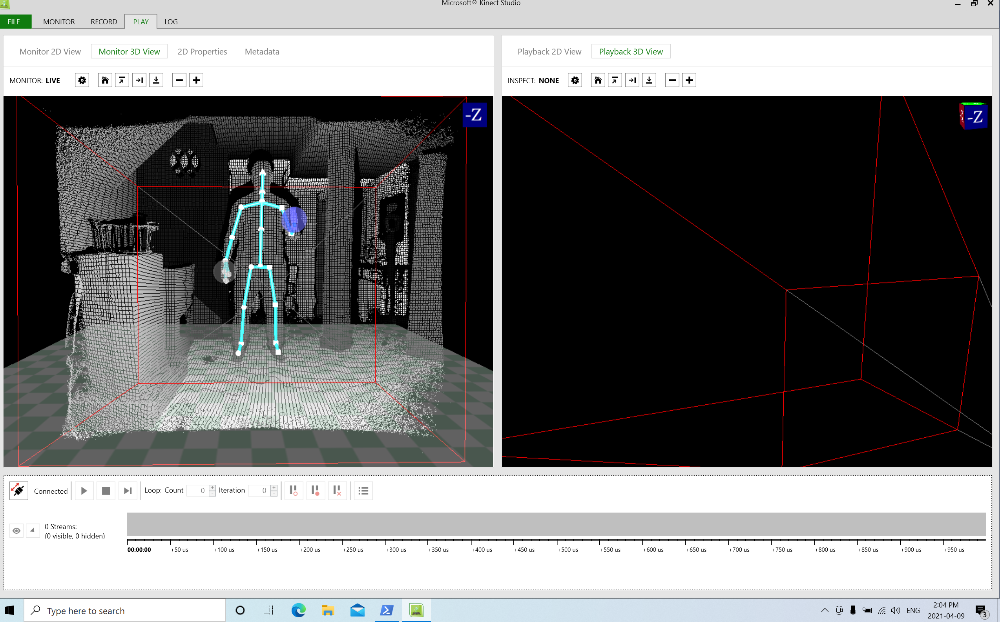

I also like using Kinect Studio as an initial "check" of the data collection space.

### 1.2 Getting the "raw" data

The raw **joint centers**, **orientations**, **timestamps**, and **states** are collected using the [DumpKinectSkeleton repository created by sebtoun](https://github.com/sebtoun/DumpKinectSkeleton) (Sebastien Andary). Kinect also includes data about the colour and depth recorded from the camera and IR sensors, respectively. However, those are not necessary for our current purposes. I will highlight some other information/uncertainties regarding the data export that weren't contained in the original repo.

First, I am not sure what Microsoft's default behaviour is regarding the "states". In other words, I'm not sure what the precise difference is between "tracked" (state = 2), "inferred" (state = 1), and "not tracked" (state=0). I've trusted Microsoft's algorithms (for now), but it's also possible to interpolate the data yourself if you don't trust it. If anyone has documentation about this, please let me know!

Second, the "JointID" legend is as follows:

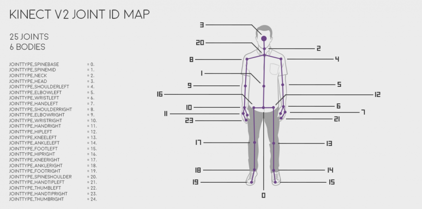

More on this in future sections.

Third, I want to expand upon using the package for those unfamiliar with using a command line interface. After downloading the latest release from the [DumpKinectSkeleton repository](https://github.com/sebtoun/DumpKinectSkeleton) located in the right column underneath the "About" section:

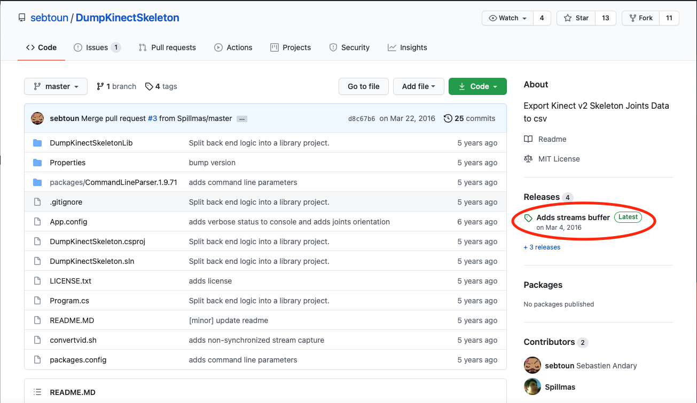

Then, unzip the folder and save it to another directory. I would suggest moving it into Documents, but you can hypothetically place this folder anywhere that you'll remember it. Then, you will need to open PowerShell.

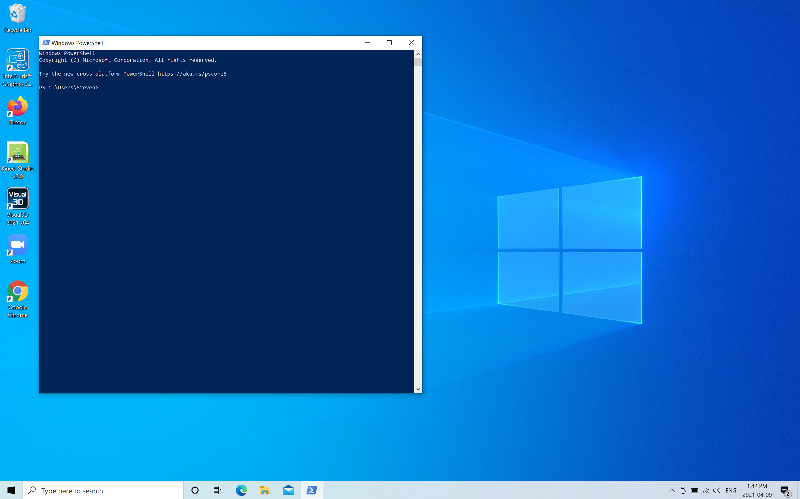

To navigate within PowerShell, you use the command `cd` followed by the pathname. For example, suppose you wanted to navigate to your documents folder. In that case, you'd need to type `cd \Documents\` into the command prompt. To collect data, navigate to the `DumpKinectSkeleton-v3.1.0` directory. If you've placed this folder in your Documents folder, you can copy and paste:

 `cd .\Documents\DumpKinectSkeleton-v3.1.0\`

into PowerShell:

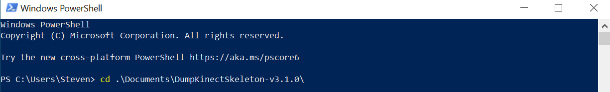

Hit enter to navigate to the appropriate directory. Next, use the command outlined in Sebastien's repo. The most common way I start collecting is by using the command:

`.\DumpKinectSkeleton.exe --prefix=pid_task`

where `PID` refers to the anonymized participant ID and `task` refers to what I am collecting (e.g., squats). If exporting video data that the Kinect records is desired, add a `-v` to your command:

`.\DumpKinectSkeleton.exe -v --prefix=pid_task`

This additional argument is helpful if you want to do other qualitative analyses along with the quantitative analyses. The video is in a yuy2 raw format, so additional processing needs to be done to "view" this video file. There are other arguments that can be used along with this function, which are highlighted in the original repository. If everything is working properly, you should see this prompt in PowerShell after hitting enter:

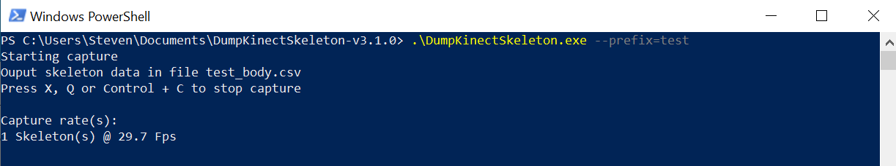

Information about the skeleton(s) found (will only record the first skeleton found), the capture rate (which is not consistent as it is dependent on the computer load and processing power, more on this later), and how to stop the data collection will be desplayed. As the prompt suggests, press control+c, x, or q to stop the recording. You should then find a csv file saved with the filename `<prefix>_body.csv` in the `\DumpKinectSkeleton-v3.1.0` folder (the `_body` suffix is added automatically to all csv files).

Once you've obtained the csv, you can either process it yourself or use the existing pipeline, which I will elaborate on below.

## 2 How is the data being processed?

### 2.1 What are the Kinect outputs?

The joint position data is relatively straightforward to understand. It refers to the X-Y-Z components of each joint in the global coordinate system (GCS). As a reminder, here are the joint positions Kinect will automatically track:

The GCS for Kinect is built using the IR sensor:

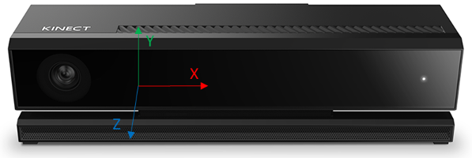

The origin of this system is located at the center of the IR sensor. The Z-axis points away from the sensor, the X-axis points to the sensor's left, and the Y-axis is pointed upwards, which is dependent on the sensor's tilt. I believe Kinect includes an alogirthm that can find the floor to correct tilt errors, but I've found that being proactive with the sensor alignment works well if you don't mind the origin remaining in the center of the IR sensor. All coordinates are measured in meters, and the recommended depth of a participant is between 1.5-4.0m away from the sensor. Further information is provided in [Microsoft's SDK](https://docs.microsoft.com/en-us/previous-versions/windows/kinect/dn772836(v%3dieb.10)).

The joint orientation data is a little more confusing given the lack of information provided in the [SDK](https://docs.microsoft.com/en-us/previous-versions/windows/kinect/dn758647(v=ieb.10)) and because the algorithms are not public knowledge. After a bit of digging and experimenting ([thank you wingcloud](https://social.msdn.microsoft.com/Forums/en-US/f2e6a544-705c-43ed-a0e1-731ad907b776/meaning-of-rotation-data-of-k4w-v2?forum=k4wv2devpreview)!), I'll explain how I got things to "click". The local coordinate system (LCS) for each joint is as follows:

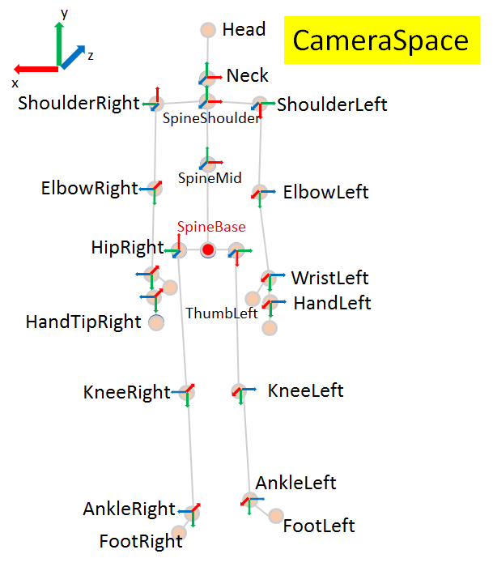

(again, all credit to wingcloud for putting this together). It seems odd at first (especially relative to traditional biomechanics software), but once you're made aware of how the default algorithm works it's not that bad. Assume one's reference posture is a T-Pose:

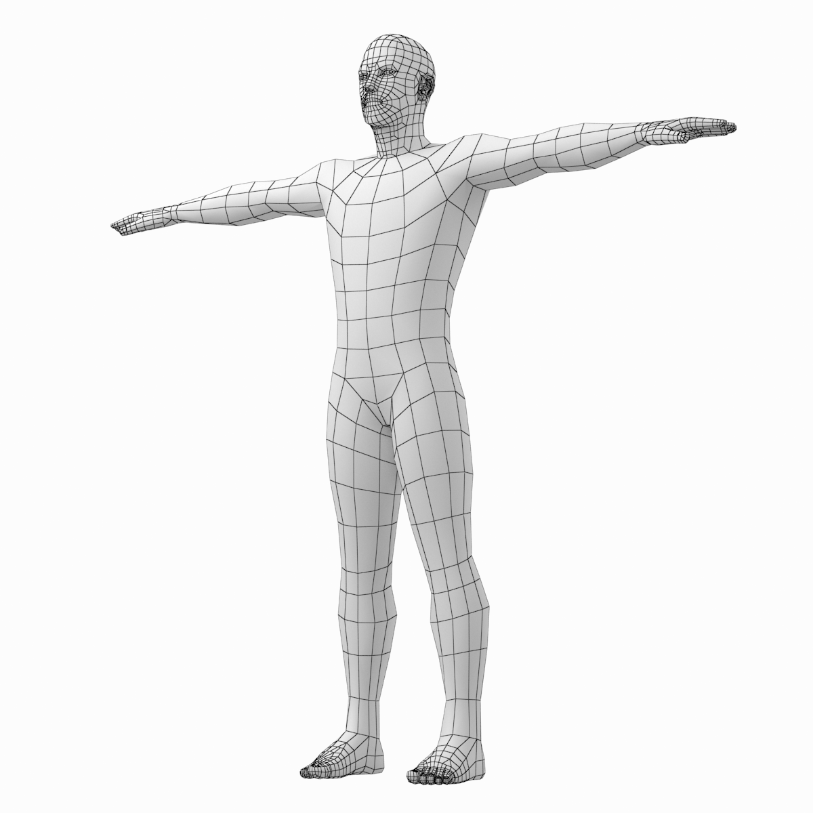

and the "home" joint is SPINEBASE. The LCS for the "home" joint is built by "mirroring" the GCS so that the LCS_Y is still vertical, but the LCS_Z now points in the negative GCS_Z direction and the LCS_X points in the negative GCS_X direction. All future LCSs are built by rotating the LCS_Y so it points in the "direction of travel" along the skeleton. For example, to build the LCS_Y for HIPRIGHT, the Y-axis must point in the direction of travel (i.e., to the right) whereas the LCS_Y for the HIPLEFT is oriented to the left (and you can probably see the "pattern" for the LCS_Y for every other joint). The X- and Z-axes are then rotated "along for the ride" as shown in the diagram above (the actual formula is provided in wingcloud's explanation in the link above; from the work I've done and what I've seen in other published studies, this is correct). Because of this, it's important that the person is faced as perpendicularly to the Kinect as possible to avoid extra code necessary that "fixes" these coordinate system offsets (there's only a single camera and sensor, so it's critical to use it as well as possible when collecting data). Since all these joints have LCSs oriented in different directions, it will be essential to make them all consistent prior to computing any joint angles (more on this below).

The other thing to note is that all orientations are defined using [quaternions](https://en.wikipedia.org/wiki/Quaternion) where `orientation.W` represents the scalar component and `orientation.X`, `orientation.Y`, and `orientation.Z` represent the i, j, and k components, respectively. Although quaternions are nice mathematical objects to describe rotations since they don't suffer from [gimbal lock](https://en.wikipedia.org/wiki/Gimbal_lock) or [Codman's paradox](https://pubmed.ncbi.nlm.nih.gov/9728676/), and are computationally efficient in comparison to rotation matrices, they are relatively difficult to interpret from a practical perspective. After all, we do these analyses for practitioners and if a practitioner asked you to describe someone's knee angle during an assessment and you provided them with the quaternions for their shank and thigh, they'd probably look for a new analyst 😊. Although I'd probably argue that any 3D rotation is somewhat difficult to interpret practically, the next section describes how the quaternions are converted to standard "biomechanical" angles that are easier for a practitioner to interpret from an anatomical perspective they are more familiar with.

### 2.2 What is the pipeline doing?

Only a high-level overview is provided in this document. Please refer to the other texts and papers for more detail on kinematic analyses. Briefly, the steps include reorienting the LCSs, creating orientation matrices, normalizing these orientation matrices to an upright standing posture, transforming the proximal LCS into the distal LCS to get the rotation matrix of a joint, and then decomposing that rotation matrix into Cardan-Euler angles. I've intentionally computed things this way so the pipeline is similar to that used in many analyses with marker-based motion capture systems (however, this is much simpler to implement relative to marker-based systems so it's great for learning).

#### 2.2.1 Reorienting the LCSs

The first thing that needs to be done is reoriented the LCSs so they all use the same coordinate system. Since the orientation data are currently quaternions (and thus `orientation.W` is dependent only on the angle of rotation and not the axis), it's as simple as swaping and negating `orientation.X`, `orientation.Y`, and `orientation.Z` to convert them to a new coordinate system (this is possible since Kinect uses a right-handed system for all rotations). Therefore, the axes are redefined so that the LCSs are consistent between joints and match that of the ISB recommendation papers.

#### 2.2.2 Creating orientation matrices

After the LCSs are reoriented to match that of the ISB recommendations, orientation matrices for each segment are built from the quaternion data. [See this Wikipedia page for more information](https://en.wikipedia.org/wiki/Quaternions_and_spatial_rotation) pertaininig to quaternions.

#### 2.2.3 Normalizing orientations to anatomical position

It's common in most biomechanics work to define joint angles relative to anatomical position so that upright standing represents 0 degrees of rotation. This is done to assist with the interpretation of the calculated joint angles. Therefore, the first trial prior to any data collection session is usually a standing calibration where the participant is recorded while standing in what is referred to as anatomical position:

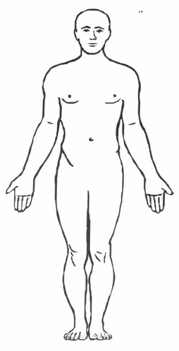

The normalized angle is computed using the orientation matrices from when the individual is in anatomical position and not by simply subtracting the joint angle from the calibration posture. This is because the computed joint angles are not vectors, and thus can't be subtracted from one another. There are other methods of normalizing joint angles, but this is the simplest to implement with the Kinect data.

#### 2.2.4 Transforming the proximal LCS to the distal LCS

Transforming the proximal LCS to the distal LCS is how joint angles are defined in biomechanics. For example, if we're interested in computing the knee angle, we are interested in assessing how much the shank has rotated relative to the thigh. Mathematically, this is described as multiplying the transpose of the orientation matrix of the thigh by the orientation matrix of the shank (because rotation matrices are orthogonal the transpose is equal to the inverse, which simplifies the computations). Remember, though, we want to compute these relative to anatomical position (i.e., the "calibration" position), so these calculations are modified slightly to include these orientations. More detail is provided specifically on page 57 of the Research Methods in Biomechanics textbook.

One thing to note is that the vocabulary for computing rotations are a little different for Kinect than what most people with biomechanics training are likely used to. This is because Kinect refers to everything as "joints" and biomechanists usually refer to the segments themselves. Below is a terminology conversion table to translate between the two "languages" when computing hip and knee rotations:

| Joint Angle | Device | Vocabulary | Data         |
| ----------- | ------ | ---------- | ------------ |
| Hip         | Kinect | Parent     | Hip Center   |
|             |        | Child      | Knee Center  |
|             | Mocap  | Reference  | Pelvis       |
|             |        | Segment    | Thigh        |
| Knee        | Kinect | Parent     | Knee Center  |
|             |        | Child      | Ankle Center |
|             | Mocap  | Reference  | Thigh        |
|             |        | Segment    | Shank        |

Therefore, the knee in Kinect is computed by expressing the ankle center orientation relative to the knee center orientation. It's slightly odd to use the joints centers when joint angles are really expressing the relationships between segments, but it's just the way that Kinect decided to name things. I'm assuming this nomenclature is easier to follow if you were trying to build animations for video games, which is what the Kinect was designed to do, so we just need to get used to the vocabulary when doing biomechanical analyses.

#### 2.2.5 Decomposing the rotation matrix

Great! We've now computed a rotation matrix for the knee. We're at the same abstract point as before with the quaternions, though, in that the rotation matrix for a joint is not very helpful for a practitioner. Thankfully, these matrices can be decomposed into something a little more interpretable using Cardan-Euler angles. An important caveat is that matrix multiplication is not commutative (which is the precise way of saying that multiplying rotation matrices A\*B is not equivalent to B\*A, as it would be for the real numbers). Therefore, the order of rotations that we specify during this decomposition matters. This can be illustrated with the following example. Use your left hand to make a coordinate system like this:

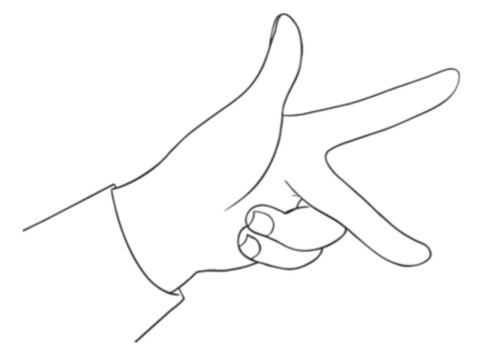

Grab your phone with your right hand and have your phone oriented so that the screen is facing upwards and the “top” of the phone is pointed forwards. Positive rotations are counterclockwise and we will only use two rotations. Rotate your phone +90 deg around your thumb, and then +90 deg around your middle finger. Your phone screen should now be pointed towards you in landscape mode with the “top” pointed to the left. Now let’s change the order of operations. With your phone in the original position, now rotate first +90 around your middle finger, and then +90 around your thumb. You are now in a different position in comparison to the rotations performed previously, with the phone now in portrait mode, the screen pointing to the right, and the “top” of the phone pointed upwards.

So what is the appropriate order of rotations? ISB recommendations is to decompose the rotations first about the mediolateral axis, then the anteroposterior axis, and finally the vertical axis. We use this order as it is equivalent to the joint coordinate system proposed by [Grood and Suntay (1983)](https://asmedigitalcollection.asme.org/biomechanical/article-abstract/105/2/136/397206/A-Joint-Coordinate-System-for-the-Clinical?redirectedFrom=fulltext) ([Cole et al., 1993](https://asmedigitalcollection.asme.org/biomechanical/article-abstract/115/4A/344/395760)). Since we don't have any predefined axes based on anatomical information with the Kinect (since it's a markerless system), this isn't a truly equivalent computation, but it's as close as we can get without using more sophisticated techniques to estimate the joint rotation axes. Using this convention, the first rotation corresponds to flexion-extension, the second rotation corresponds to abduction-adduction, and the third rotation refers to internal-external rotation of a joint. This roughly corresponds the motions-in-planes interpretations of joint angles that therapists are used to dealing with.

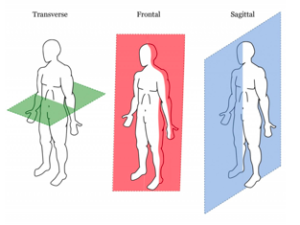

Although, it must be made clear that **motion about axes is not equivalent to motion in planes**, even though we might talk about them that way (Zatsiorsky's Kinematics of Human Motion textbook is a great resource for more details pertaining to this & kinematic analysis in general). Further, these rotations are simplifications of the actual motions that occur at a joint. These simplifications are likely fine for the level of analysis that the Kinect is useful for, but these underyling assumptions should be made explicit to best understand what the data can and can't tell us. Again, caution is advised when interpreting these angles, especially for the second (abduction-adduction) and third (internal-external) rotations.

#### 2.2.6 Data export

The Python pipeline will automatically perform these computations and export the data into a new csv file for you to explore. To install the pipeline, either clone this repository, download it as a ZIP (green "code" button at the top of the screen) or create a `kinectPipeline.py` file in a text editor and then copy and paste the code from this repository into that file. The command to run the pipeline in PowerShell (or Terminal if you want to process the data using macOS or Linux), assuming the python file is located in your current working directory, is:

`python kinectPipeline.py -i <inputfile> -c <calfile> -o <outputfile>`

where the relative filepath for the data you'd like to process is written after `-i`, the calibration trial is written after `-c`, and the resulting output filename after `-o`. For example, let's say I am analyzing a squat trial for a participant with the anonymized id of 12. Processing the data with the command may look something like this if you are using Mac or Linux (simply substitute the forward slash for backward slashes, as was shown in the examples above, if you are working with Windows):

`python kinectPipeline.py -i data/p12_squats_body.csv -c data/p12_standcal_body.csv -o processed_data/p12_jointangles.csv`

Which would take `p12_squats_body.csv` and `p12_standcal_body.csv` from the `data` directory and then save the resulting processed file, `p12_jointangles.csv` into an existing directory named `processed_data`.

If you're like me and will amost certainly forget the syntax for this command and need to refresh yourself, you can use the argument `-h` for help.

The csv file from this export will include the frame number, the time stamp corresponding to the frame number, and the mediolateral, anteroposterior, and vertical rotations of the hip and knee joint.

#### 2.2.7 Miscellaneous data collection tips

- There is only one camera, so if any joints are occluded there will be larger errors in the resulting output. Do your best (without disturbing the "natural" motion of the participant) to ensure that joints are easily visible by the cameras for the entire collection to limit the interpolations that need to be done during post-processing.
- Wait until the skeleton is found prior to initiating any movements. I would suggest providing a small buffer between the DumpKinectSkeleton command and the start of the exercise in all collections.

#### 2.2.8 Intentional omissions

You might be wondering why none of the data was filtered in the pipeline. The main reason for this is because the filtering methods are somewhat sensitive to the people and tasks one is planning to collect, so I didn't want to make that decision (yet). I'm hoping to include a boolean for filtering the data once I've decided how I want to deal with the "raw" quaternions in the future, but for now it's raw data only. For teaching purposes, I think this can either highlight the importance of filtering data and/or provide an opportunity to apply smoothing techniques to data you've collected yourself.

Second, as mentioned earlier, the Kinect doesn't always collect at a consistent sample frequency. Depending on the processor and current computer load it can drop below the standard rate of 30fps. Personally, I've found it almost always samples at about 30fps on my 2015 13inch MacBook Pro running Windows 10, but regardless, resampling the data at a consistent frequency is necessary if you wanted to scale this to some other research application or assess the Kinect's validity. For teaching purposes, I think it would suffice to simply use the frame number or timestamps themselves to visualize the data. Alternatively, you can implement your own resampling algorithm.

Finally, I've only included rotations for the hip and knee joint as they can be applied for gait analysis or other lower extremity exercises. Given that upper extremity motion is quantified a bit differently (a different rotation sequence is recommended to the one provided in this pipeline) and it is less relevant to some of the "beginner" things I am exploring with this pipeline, I've omitted it. The principles outlined in this document should be helpful to guide future work and teaching projects for other joints.

#### 2.2.9 Fun things to try for those who are keen to explore further and refine your modelling skills

- use only quaternions to get the same rotations about the mediolateral, anteroposterior, and vertical axes
- use PCA to "correct" for the potential errors in the second and third rotations, as in [Baudet et al. (2014)](https://journals.plos.org/plosone/article?id=10.1371/journal.pone.0102098) or [Skaro et al. (2021)](https://asmedigitalcollection.asme.org/biomechanical/article/143/5/054501/1096599?casa_token=MrUib7bkkdEAAAAA:ECwOFkkwHSiKUbQw7FXa7KvWmFnlCmMe9jzCVA1UbtV-BKGF4Sr5eXXNsie8vawP-pLnK6k) (note: the cross-talk errors are due to the difficulties in specifying the axes of rotation when using marker-based systems, which are technically not defined using any anatomical information with Kinect. Having said this, PCA will almost certainly reduce of the magnitude of the second and third rotations considerably in the Kinect)

## 3 Next Steps

I have a few next steps planned for this repository. If you (or anyone you know) is interested in contributing to this repo or collaborating on some of these potential projects please let me know!

- Filter quaternions (default is to filter data, but option to be included to get raw data)
  - Extended Kalman filter?
- (Recurrent) Neural Network to "correct" joint angle data relative to a multi-camera system (e.g., Qualisys, Vicon)
  - validation of both the "raw" Kinect and an ML correction alogrithm in comparison to gold-standard systems with more exercise tasks (e.g., squats, hinges, lunges, jumps)
- Add joint angular velocities and accelerations
